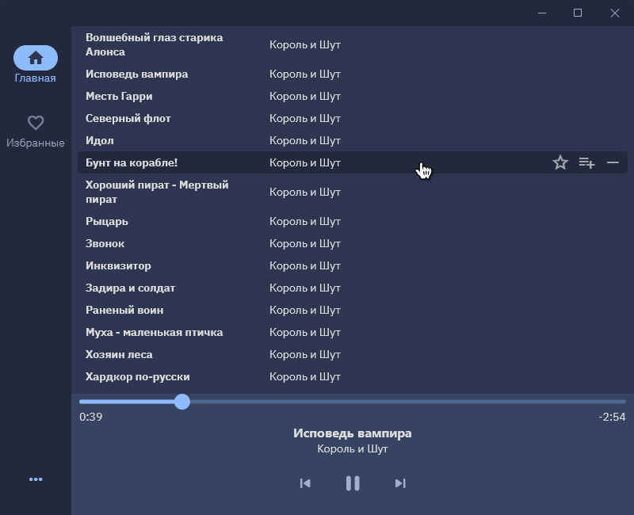

# **Spiccato**

Десктопное приложение для прослушивания аудиофайлов, написанный на **Flutter/Dart**.

## Демо

## Используемые библиотеки
- [bitsdojo_window](https://pub.dev/packages/bitsdojo_window)
- [dart_vlc](https://pub.dev/packages/dart_vlc)
- [provider](https://pub.dev/packages/provider)
- [desktop_drop](https://pub.dev/packages/desktop_drop)
- [audio_video_progress_bar](https://pub.dev/packages/audio_video_progress_bar)
- [dotted_border](https://pub.dev/packages/dotted_border)
## Roadmap

- Добавить больше контроля (перемешать плейлист, изменить громкость).
- Сохранять избранные аудиофайлы.
- Добавить страницу настроек.
- Добавить возможность свернуть в трей.
- Создать установщик и вылить его открытый доступ.
- Подготовить к [публикации][Статья о публикации] в Windows Store.

[Статья о публикации]: https://habr.com/ru/post/152039/